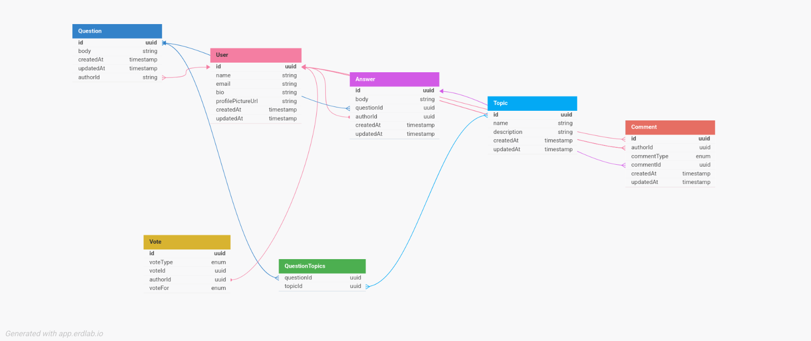

# Quora backend

## 🎯 Objective

```
	A simple Quora-style backend built using GraphQL
```

---

## 📋 Requirement analysis

### ✅ Functional requirements

- **Question** – Users should be able to post and browse questions.
- **Answer** – Users can post answers and view all answers for a question.
- **Comment** – Users can comment on both answers and other comments.
- **Followers** – Users can follow/unfollow others, view their followers, and see who they’re following.
- **Topic** – Users can tag questions with existing topics or create custom ones.
- **Login & Registration** – Basic authentication features allowing users to register and log in.
- **Like / Dislike** – Users can like or dislike comments and answers.
- **Profile** – Users should be able to view their profile, including avatar, bio, follower count, and following count.

### ⚙️ Non-functional requirements

- **Security** – Fine-grained access control with proper authentication and authorization mechanisms must be enforced.
- **Low Latency** – The system should be responsive under any number of user requests, ensuring minimal delays.

---

## 🗂️ Project structure

```
	Follow a *feature-oriented* structure for a clean and scalable codebase.
```

👉 [Project structure guide](https://javascript.plainenglish.io/writing-a-node-js-graphql-backend-that-actually-scales-a-complete-guide-part-1-setup-cddceae25bdc)

📌 **Why feature-oriented?**

- It's aligned with **Domain-Driven Design** (DDD) principles.
- Avoids scattering logic across multiple unrelated folders – a common issue in **layer-oriented** structures.

## 🗃️ ER Diagram


